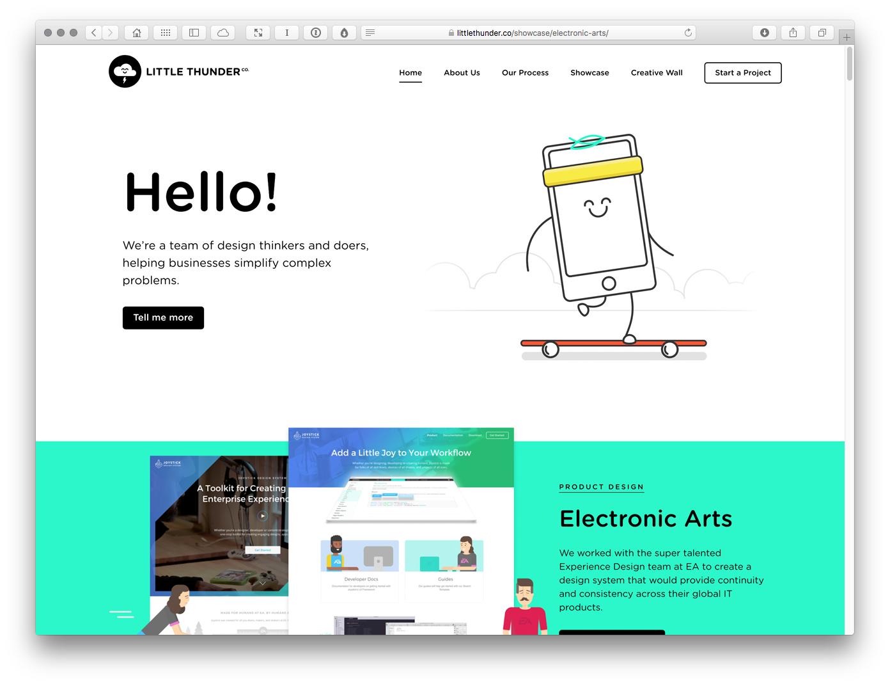

Case Study: Little Thunder
==========================

https://littlethunder.co

A boutique experience design business based in Belfast, Little Thunder was founded in 2013 by designers Gaby Muldoon and Tim Potter. Over its half a decade history, the company has grown from a two man team to a digital agency that now has a rapidly expanding team of designers,  developers and animators.

As the company has grown, its client base has expanded from a local focus with clients based largely in Belfast, to an international focus with clients further afield.

Little Thunder now counts Electronic Arts (EA), Visa and PwC as clients, and it’s a measure of the esteem in which the company is held that many global businesses now pay a retainer to secure their services.

Muldoon and Potter graduated from Belfast School of Art’s interaction design programme in 2004 and 2006, respectively. After joining the art school’s teaching team they co-founded the company. As they put it, “The ‘co’ originally stood for collaboration, now it stands for company.”

Side projects are an important part of the company’s culture. Their children’s picturebook ‘Chalky and the New Sports Car’ successfully secured £13K on Kickstarter in 2014 and, more recently, they’ve spun out their lovingly illustrated learning materials ‘Little Steps’ (https://littlesteps.to) into a standalone, education-focused business in its own right.

They believe that side projects are important for acquiring and honing new skills and they practice what they preach. Always learning they’re a team that’s making its mark on a world stage, thanks to their work developing design systems for companies like EA and others.