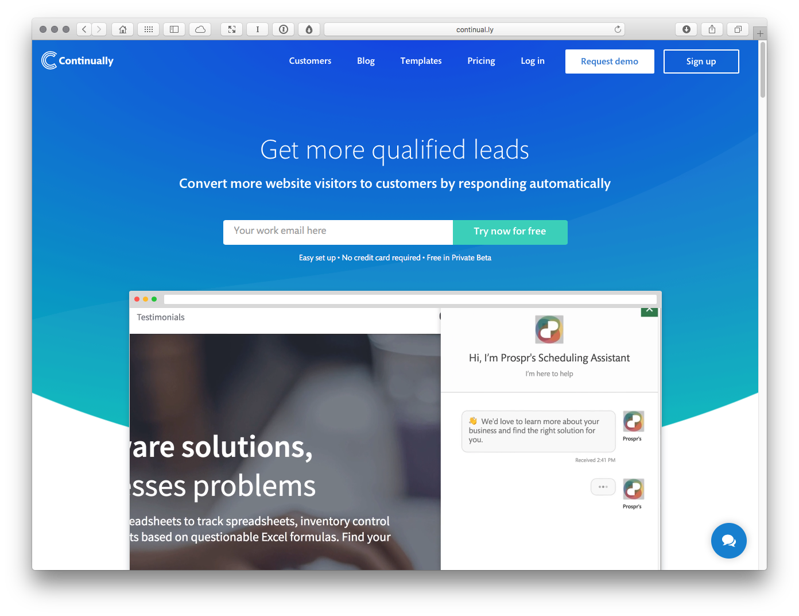
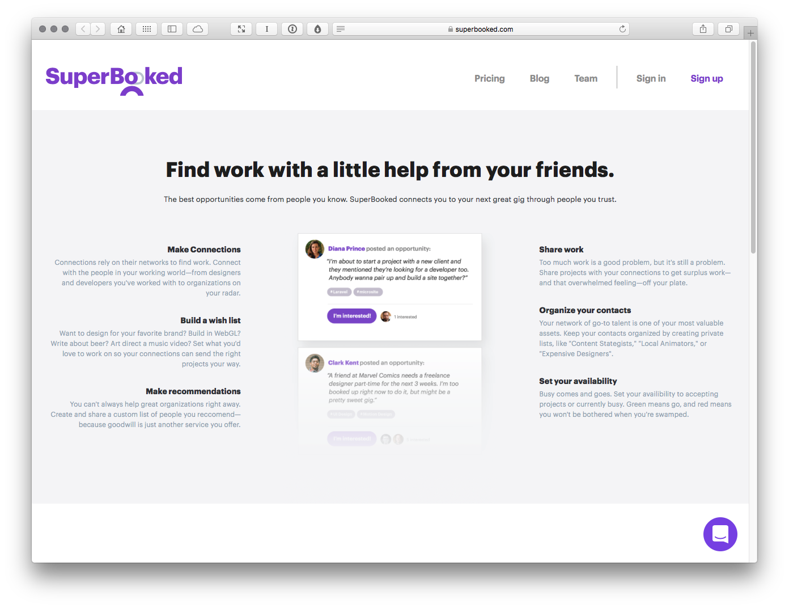

Customer Acquisition
====================

A company can’t grow without clients, so the following tools are perfectly positioned for the task of generating and managing leads, enabling you to widen your client base.

Continually
-----------

http://continual.ly

Designed by the team that built Typecast, Continually is a tool that’s designed to get you more qualified leads. Using chatbots and machine learning, Continually allows you to respond to prospective leads automatically, out of hours and across time zones. It’s like your virtual, always-on PA and it’s well worth installing.

Superbooked
-----------

https://superbooked.com

Superbooked – the brainchild of noted designer Dan Mall – is a tool that’s designed to help you find work with a little help from your friends. Built on the idea that the best opportunities come from the people you know, SuperBooked connects you to opportunities through people you trust.

fullstory
---------

https://www.fullstory.com

Although not a lead generation tool per se, fullstory captures page insights from your site, helping you design a more enticing proposition. It helps identify points where people are confused and pinpoints content they engage with, helping you craft a better pitch.