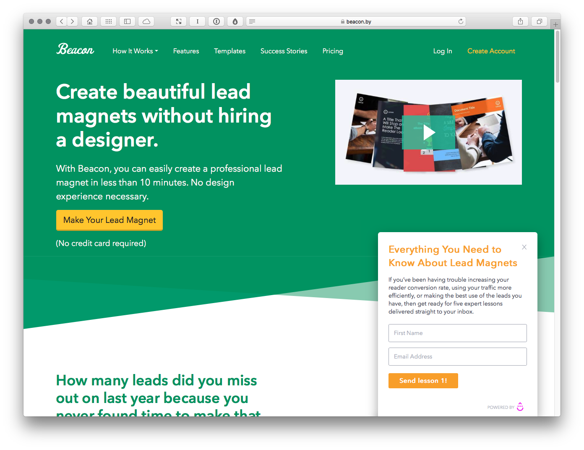
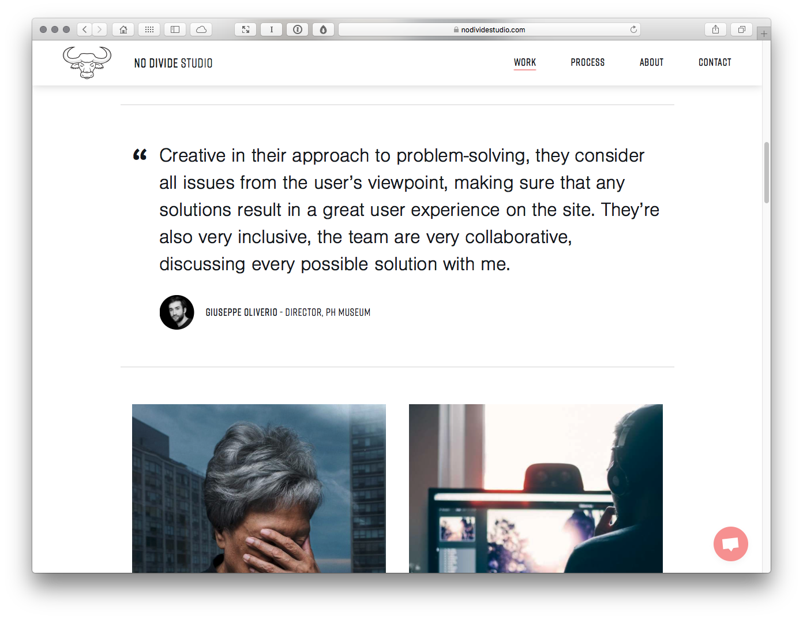
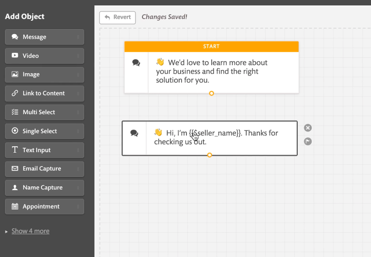

Screenshots
===========

Caption: Putting some thought into your design process enables you to work more efficiently. Hop Onboard! (http://hoponboard.io) offers an overview of the client onboarding process.

Caption: Building your client base with lead magnets is simple with Beacon (https://beacon.by). Helpfully they provide a lead magnet that explains lead magnets. Meta!

Caption: Our industry moves so fast, it’s important to keep on learning. Sharing side projects – undertaken in studio down time – is a good way to keep your knowledge current and it’s good marketing, too.

Caption: The team at No Divide (https://nodividestudio.com) share testimonials from past clients, underlining their established track record. 

Caption: There are a growing number of client engagement tools that use automation to help you build a 24/7 virtual chatbot sales team.