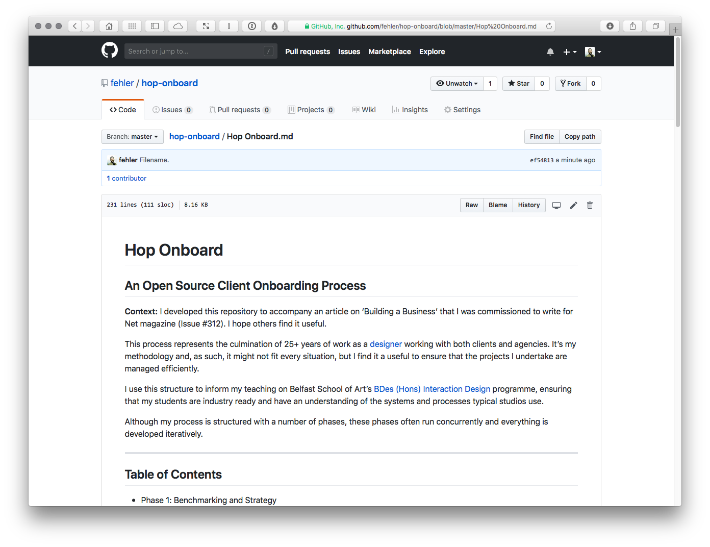
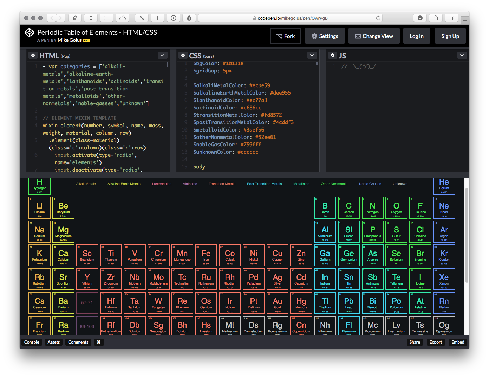

Screenshots
===========

Caption: Putting some thought into your design process enables you to work more efficiently. A client onboarding process helps considerably, in the spirit of sharing best practice I put together ‘Hop Onboard’ (URL) to accompany this article.

Caption: Our industry moves so fast, it’s important to keep on learning. Sharing side projects – undertaken in studio down time – is a good way to keep your knowledge current and it’s good marketing, too.

/* Testimonials Screenshot */

Caption: Sharing testimonials from your past clients helps put new clients’ mind at rest by showing you have an established track record.

/* Chatbots Screenshot */

Caption: There are many tools designed to improve lead generation. Continually’s chatbots can be programmed to engage with potential clients, helping to secure business, even while you sleep.