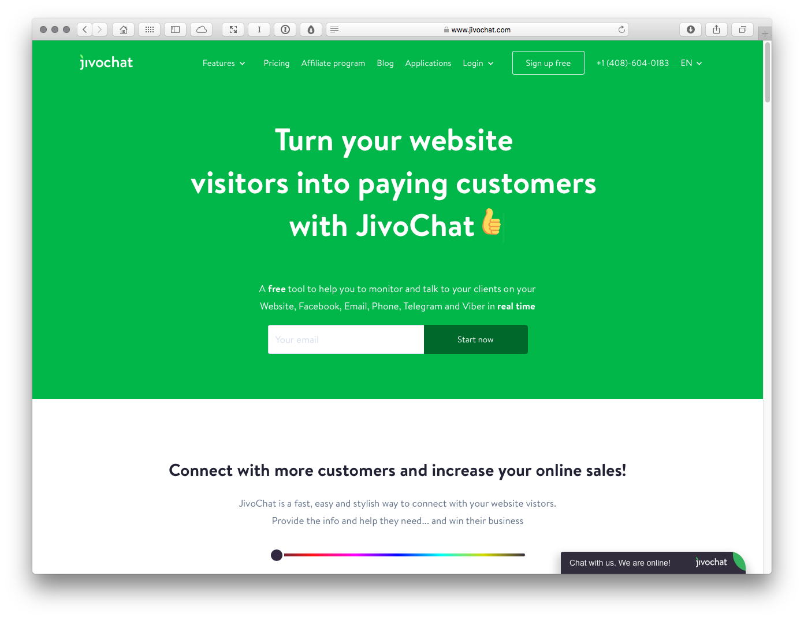

Screenshots
===========

Caption: There are a growing number of client engagement tools that use automation to help you build a 24/7 virtual chatbot sales team.

Turn your website visitors into paying customers with JivoChat (http://bit.ly/jivoreferral).

Caption: Building your client base with lead magnets is simple with Beacon (https://beacon.by). Helpfully they provide a lead magnet that explains lead magnets. Meta!

Caption: Our industry moves so fast, it’s important to keep learning. Side projects – undertaken in down time – are a great way to keep your knowledge current and they’re good marketing, too.

Caption: Hop Onboard! (https://github.com/fehler/hop-onboard/) is an open source process that enables you to supercharge your client onboarding experience.

Caption: The team at No Divide (https://nodividestudio.com) share testimonials from past clients, underlining their established track record. 

