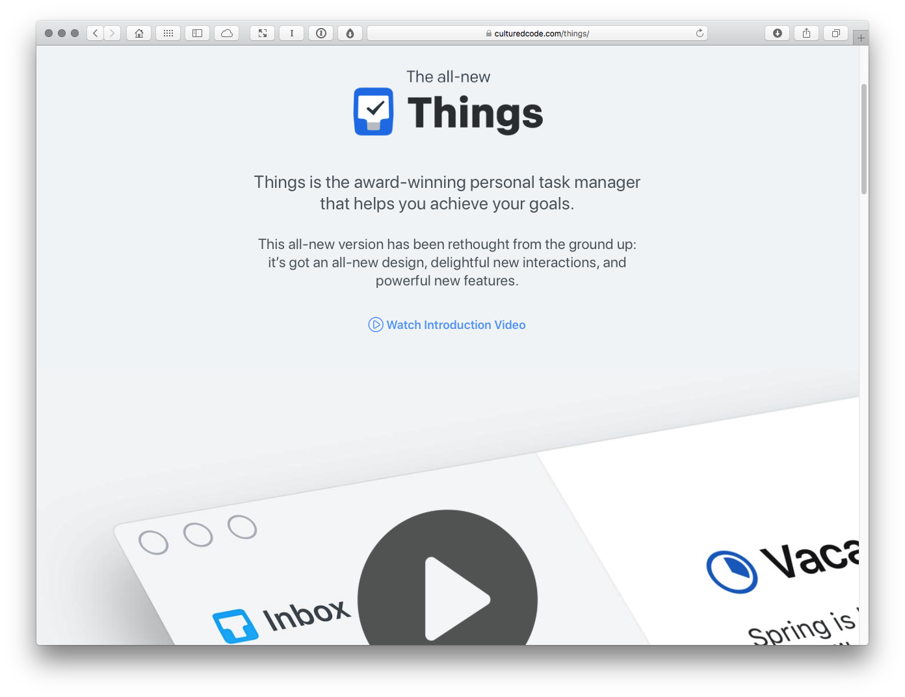

Tasks
=====

<!-- Word Count: 470-520 Words (Image.) -->

Strap: Christopher Murphy tackles the tricky topic of task management in an increasingly busy age.

----

<!-- 530 Words in last article. ~265 X 2 -->

As knowledge workers toiling at the digital coalface, we regularly find ourselves managing multiple tasks at once. All too often those tasks add up, rendering it hard to focus and get things done.

Establishing a task management, or to-do, system can make all the difference. Your system might be analogue or digital, regardless, it’s important to have a system.

One approach on the analogue side of the equation is the ‘Bullet Journal’ (www.bulletjournal.com), which bills itself as, “The analogue system for the digital age.” Ryder Carroll, creator of the Bullet Journal method, even has a book offering the tantalising prospect that you can: “Track the past, order the present and design the future.”

The Bullet Journal method is tailored around a system of bespoke bullets: points (‘.’) for to-dos; circles (‘o’) for events; dashes (‘–’) for notes; and so on. It might sound complicated, but like any system it gets easier with practice. If you’ve been tracking to-dos via a notebook, it’s worth spending a little time exploring the methodology, which can enhance your existing approach.

On the digital side of the equation, tools like Things (www.culturedcode.com) offer a seamless, software-driven approach to the tricky task of managing tasks. A personal task manager for Apple’s various devices, Things is designed to help you manage and achieve your goals, allowing you to gather all your tasks in one place.

A beautifully designed suite of applications that won an Apple Design Award in 2017, Things makes tracking tasks enjoyable with its delightful interactions. Even if you’re not bought in to Apple’s operating systems, Things is still worth exploring for its carefully considered user experience design.

The Myth of Multi-Tasking
-------------------------

Mapping out your multiple tasks is, of course, only half of the equation; the other half of the equation is actually doing them, which is where a strategy of focused single-tasking comes in.

Doubtless everyone’s heard of multi-tasking, the magical ability to undertake multiple tasks in tandem. The trouble is, multi-tasking is a myth. (Or, more accurately, it’s possible, it’s just not productive.) A better approach is to focus on single tasks, sequentially.

Neuroscience suggests that multi-tasking is not only more stressful than undertaking tasks individually, it’s also less productive and technically not even possible. What we think of as multi-tasking is, in fact, just the brain switching rapidly between tasks and doing so inefficiently.

Adam Gazzaley, a neuroscientist at University of California, San Francisco, summarises the pitfalls of multi-tasking in a series of academic papers on the subject, and in an excellent book, ‘The Distracted Mind’ (http://bit.ly/thedistractedmind).

/* Switch out from here. */

Gazzaley notes that distractions, often technology-related, act as ‘interference’, inhibiting our ability to get the task at hand done.

A far better approach is to sidestep multi-tasking and work your way through your task list a single task at a time.

/* Above needs fixed re. http://bit.ly/memoryandmultitasking */

Everyone has their own preferred task management method, and your approach, like mine, might bridge the analogue and digital divide. The important thing is to have a system. Establish a method that maps everything – be it analogue or digital – and you’ll find your productivity soar.

<!--

The key to productivity lies in establishing a system that ensure you remain focused and on point.

-->

Caption: An award-winning task manager, Things helps you manage your tasks and tick them off, one by one.

----

INFO

Job: Writer, designer and educator  
t: @fehler  
w: mrmurphy.com  

