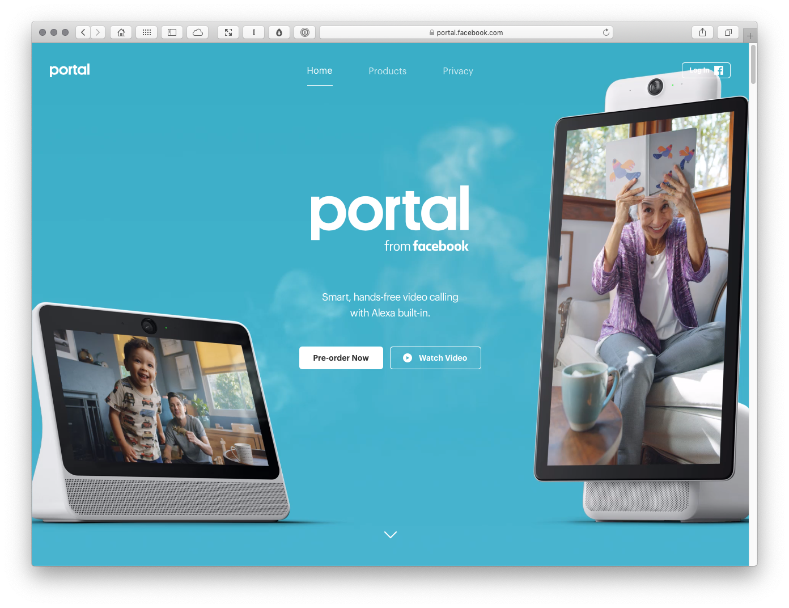

Trust
=====

<!-- Word Count: 470-520 Words (Image.) -->

Strap: Christopher Murphy explores the importance of trust, one of every business’s most valuable commodities.

----

<!-- 530 Words in last article. ~265 X 2 -->

Whatever you’re selling – be it a product or service – there’s one commodity in business that changes hands, whether money is involved or not: trust.

Whether you’re working on a client project that involves confidential information or gathering your customer’s intimate personal details within a SaaS product, it’s important that you keep the bond of trust between business and customer sacred.

Over the last year, we’ve witnessed a number of high profile cases where the bond of trust between business and customer has been handled without the respect it deserves.

Facebook’s launch of Portal – and the subsequent backlash the product received on social media – is evidence of how a breach of trust can erode brand loyalty in a manner that can rapidly spiral out of control. Why? Because the business abused the trust of its customers.

Facebook’s handling of the Cambridge Analytica scandal – particularly the reticence of Mark Zuckerberg, Facebook’s CEO, to step up and accept some responsibility – significantly eroded trust in the brand.

This, compounded with earlier reports that Zuckerberg had branded Facebook’s customers, “dumb f_cks,” for trusting the business with their data (http://bit.ly/fbdumbfucks), added up to a culture of disregard and – as these things have a habit of doing – came back to haunt the business. Facebook, of course, is not alone.

Google Minus
------------

On 8 October, Google announced ‘Project Strobe’ an initiative designed to protect customers’ data, improve the business’s third-party APIs, and – tucked away at the end of the list – sunset Google+.

Buried in the announcement was an admission that one of Google+’s APIs had leaked the private information of over 500,000 users to third-party developers between 2015 and 2018.

Leaking the private information of half a million users is bad enough, but what was worse was the fact that an internal memo, obtained by the Wall Street Journal, revealed Google had covered up the breach due to fear of regulatory repercussions. As the Journal summarised:

> The memo […] warned the company’s senior executives that disclosing the incident would spark “immediate regulatory interest” and that it “almost guarantees [CEO] Sundar [Pichai] will testify before Congress.”

That Sundar Pichai, Google’s CEO, was aware of this and chose to keep the breach buried is alarming. It demonstrates either: a lack of understanding of the importance of the bond of trust between a business and its customers, or a flagrant disregard for those customers.

The damage that this breach of trust does to Google’s brand is measured not in days, weeks or months, but in years. There are, of course, lessons to be learned here and you don’t need to be a company the size of Google to learn them.

Trust is your most important commodity.

Cultivating an open and honest business culture will pay dividends in the long run. When things go wrong, as they occasionally do, own up and take responsibility. Your customers will appreciate your honesty and you’ll protect that all-important bond of trust that, deep down, drives your business.

Caption: With Facebook’s tarnished trustworthiness, it’s no surprise that Portal launched to widespread backlash.

----

INFO

Job: Writer, designer and educator  
t: @fehler  
w: mrmurphy.com  

